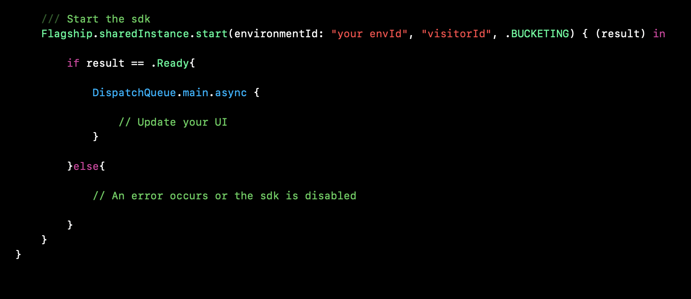
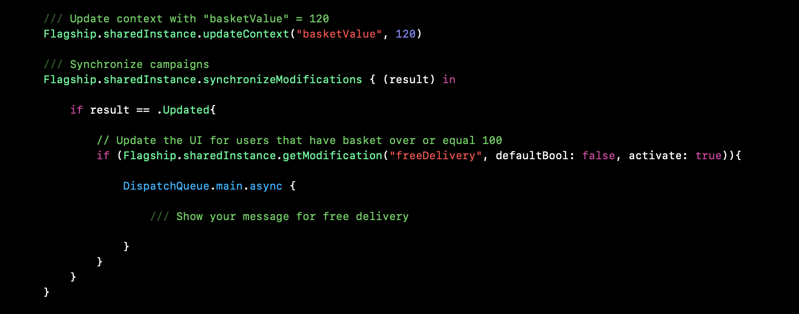
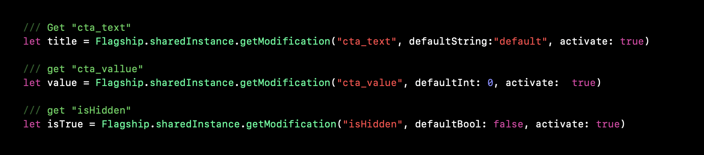
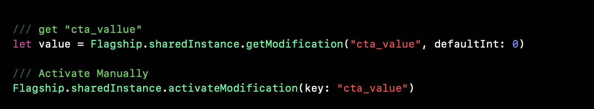
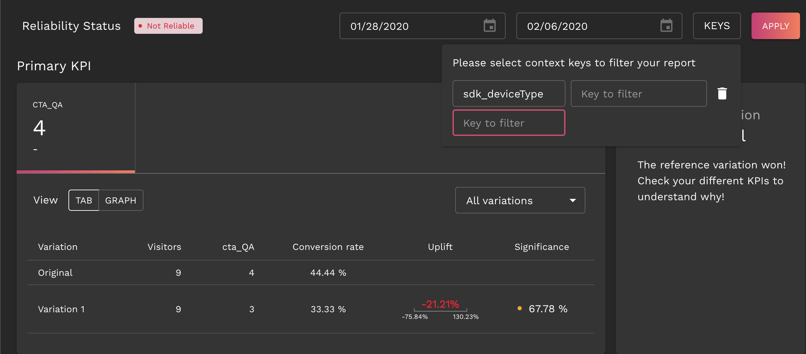

<p align="center">


</p>

<h3 align="center">Bring your features to life</h3>
<a  href='https://github.com/jpoles1/gopherbadger'  target='_blank'></a> 
 [](./LICENSE)
**Visit [https://developers.flagship.io/](https://developers.flagship.io/) to get started with Flagship.**

# Introduction to iOS SDK

Welcome to the Flagship iOS SDK documentation!

The following documentation helps you to run Flagship on your native ios app.

The SDK helps you :

 - Set a visitor id
 - Update visitor context
 - Allocate campaigns from the decision api or Bucketing
 - Get modifications
 - Launch campaigns
 - Send Hits

Feel free to [contact us](mailto:product@abtastycom) if you have any questions regarding this documentation.

## App prerequisites

* Your app must be a native app written in Swift or Objective C.

* Flagship SDK supports at least ios 8.0+

* Swift Client application must use Swift 5 or higher

# Getting started
Our Flagship iOS SDK is available for distribution through CocoaPods, Swift Package Manager or manual installation.


## Cocoapods

```ruby
target 'Your App' do
  use_frameworks!

  pod 'Flagship'

  end
```
 
1. <a href='https://guides.cocoapods.org/'>Install CocoaPods.</a>

2. Open Terminal and browse to the directory that contains your project then, enter the following command: `pod init`

3. Open your Podfile and add the following line to the Podfile 

4. Run `pod install` from your Xcode project's base directory

5. Make sure you always open the Xcode workspace and not the project file when building your project

## Manual Installation

1. Download the frameWork  <a href='http://sdk.abtasty.com/ios/Flagship.framework.zip'>Flagship.</a>

2. In Finder, browse to the Flagship.framework file and move it under your "Embedded Binaries" section in Xcode

3. Upon moving it, a popup is displayed: check "Copy items if needed".


### Apple Store Submission

```Swift
APP_PATH="${TARGET_BUILD_DIR}/${WRAPPER_NAME}"

# This script loops through the frameworks embedded in the application and
# removes unused architectures.
find "$APP_PATH" -name '*.framework' -type d | while read -r FRAMEWORK
do
FRAMEWORK_EXECUTABLE_NAME=$(defaults read "$FRAMEWORK/Info.plist" CFBundleExecutable)
FRAMEWORK_EXECUTABLE_PATH="$FRAMEWORK/$FRAMEWORK_EXECUTABLE_NAME"
echo "Executable is $FRAMEWORK_EXECUTABLE_PATH"

EXTRACTED_ARCHS=()

for ARCH in $ARCHS
do
echo "Extracting $ARCH from $FRAMEWORK_EXECUTABLE_NAME"
lipo -extract "$ARCH" "$FRAMEWORK_EXECUTABLE_PATH" -o "$FRAMEWORK_EXECUTABLE_PATH-$ARCH"
EXTRACTED_ARCHS+=("$FRAMEWORK_EXECUTABLE_PATH-$ARCH")
done

echo "Merging extracted architectures: ${ARCHS}"
lipo -o "$FRAMEWORK_EXECUTABLE_PATH-merged" -create "${EXTRACTED_ARCHS[@]}"
rm "${EXTRACTED_ARCHS[@]}"

echo "Replacing original executable with thinned version"
rm "$FRAMEWORK_EXECUTABLE_PATH"
mv "$FRAMEWORK_EXECUTABLE_PATH-merged" "$FRAMEWORK_EXECUTABLE_PATH"

done
```


<aside class="notice">
<b>Flagship FrameWork is universal and BitCode supported</b> <br>
The universal framework for iOS contains architectures for simulators and devices. You will therefore be able to run your application on all devices and all iOS simulators.
</aside>

if  your app contains a universal framework, the App store will reject your app because of an unwanted architecture.
You need to add a new build phase, then select `Run Script` to add a new build step after `Embed frameworks`.
In the `Shell` field, enter the script described in the next column.

## Swift Package Manager (SPM)

You can search for **Flagship** package on GitHub. Add your GitHub or GitHub Enterprise account in Xcode’s preferences, and a package repository appear as you type.

<div class="video-tuto"></div>

</br>

For more information about Swift Package Manager click <a href="https://developer.apple.com/documentation/xcode/adding_package_dependencies_to_your_app">here</a> to see the apple Documentation


## Configure and Start Flagship

### Start Flagship in your App

```Swift
import Flagship


////////////////////////////////////////////////////////////////////
/////////// Start SDK Flagship /////////////////////////////////////
////////////////////////////////////////////////////////////////////

//// Manage mode for Flagship
let mode:FlagshipMode = modeSwitch.isOn ? FlagshipMode.BUCKETING : FlagshipMode.DECISION_API

/// Set Mode for sdk
let modeSdk:FlagshipMode = .BUCKETING  /// or: DECISION_API

/// Start the SDK
Flagship.sharedInstance.start(environmentId:"your envId" , "visitorId", modeSdk) { (result) in


  if result == .Ready {
    DispatchQueue.main.async {

      /// Update UI
    }

    }else{

      /// An error occurs or the SDK is disabled
    }


  }


////////////////////////////////////////////////////////////////////
/////////// Start SDK Flagship for Apac Region////////// ///////////
////////////////////////////////////////////////////////////////////

/// Set the context of VIP user 
Flagship.sharedInstance.updateContext("isVip", true)

/// Set Mode for sdk 
let modeSdk:FlagshipMode = .BUCKETING  /// or:  DECISION_API

/// Create the APAC region object and make sure to remplace "Your_API_key" by your own API key
let apacRegion:FSRegion = FSRegion("Your_API_key")

/// Start the SDK
Flagship.sharedInstance.start(environmentId:"your EnvId" , "visitorId", modeSdk, apacRegion: apacRegion) { (result) in


  if result == .Ready {

    DispatchQueue.main.async {

      /// Update UI
    }

    }else{

      /// An error occurs or the SDK is disabled
    }


  }
            

////////////////////////////////////////////////////////////////////
/////////// To let Flagship generate a visitorId for you ///////////
////////////////////////////////////////////////////////////////////

/// Start Flagship with generated visitorId 
Flagship.sharedInstance.start(environmentId:"your EnvId",nil,.BUCKETING) { (result) in
  
  // The state is ready, you can now use the SDK
  if result == .Ready {
    DispatchQueue.main.async {
      // Update the UI
    }
    }else{

      /// An error occurs or the SDK is disabled
    }
  }
}
// To get your generated visitorId, use:  
Flagship.sharedInstance.visitorId
    
```

```Objective-C
// Define context
[[Flagship sharedInstance] updateContext:@{@"basketNumber":@200, @"isVipUser":@YES}];

  /// start the SDK 
[[Flagship sharedInstance] startWithEnvironmentId:@"your envId" :@"visitorId" :FlagshipModeBUCKETING :nil completionHandler:^(enum FlagshipResult result) {

  if (result == FlagshipResultReady){

    dispatch_async(dispatch_get_main_queue(), ^{

     self.storeBtn.hidden = NO;

                    // Get the title for VIP user
     NSString * title = [[Flagship sharedInstance] getModification:@"vipWording" defaultString:@"defaultTitle" activate:YES];

                    // Get the percent sale for VIP user
     float percentSales = [[Flagship sharedInstance] getModification:@"percent" defaulfloat:10 activate:YES];
   });
  }
}];
    
```

To run experiments with Flagship, you will need to start the SDK. Flagship uses a sharedInstance that can **activate** experiments and **track** events.


### `start(environmentId:String, _ visitorId:String?,_ mode:FlagshipMode,apacRegion:FSRegion? = nil, completionHandler:@escaping(FlagShipResult)->Void)`

</br>

Parameter | Type | Required |Description
--------- | ------- |-------- |-----------
environmentId | String | Yes |Your environment id
visitorId  | String |Yes | visitorId of the current visitor.
mode       | FlagshipMode |Yes |  Start Flagship SDK in **BUCKETING** mode (client-side) or in **DECISION_API** mode (server-side) [FlagshipMode](#flagship-mode)
apacRegion | FSRegion |NO | By default this value is **nil**. This option is used for Apac region  **FSRegion("Your_API_key")**
completionHandler | block |Yes| The block to be invoked when the sdk is ready

</br>

<aside class="success">
  Listening to our customer, we decided to manage the call of the environmentId directly from the start method and not from a .plist file anymore. </br>
  Your feedback are really precious, don't hesitate <a href="mailto:product@abtasty.com">to give us some</a>!
</aside>

</br>

<aside class="notice">
<b>Notice Information:</b></br>
  - If <code>visitorId</code> is <b>nil</b>, the sdk will automatically generate one.</br>
  - The old start SDK option is still working but is deprecated, this option will be removed in the next release.</br>
  - The <code>apacRegion</code> option is only available for Early Adopter users. If you want to be part of it, <a href="mailto:product@abtasty.com">contact us</a>!
</aside>

</br>

<aside class="warning">
We let you the possibility <b>to change the envId</b> (i.e for QA purposes).
Thus, when changing environment, <b>don't forget to delete the cache of your app.</b>
</aside>

</br>

`FlagshipResult` indicates the state of the SDK   <b>Ready</b> | <b>NotReady</b>

<ul>
<li><b>Ready</b>    : <em>That mean the SDK is <b>ready</b> to use and you can get all modifications and send events</em></li>
<li><b>NotReady</b> : <em>That mean an error occured at the initialization for some reason (See the logs), only a default value is returned when you call getModification</em></li>
</ul>


As the SDK is asynchronous and runs in parallel, this method enables you to set a block which will be executed when the SDK is ready.

</br>

<aside class="success">
<b> Remember to replace "your EnvId" with your own.</b></br>
1. Navigate to <b>Parameters</b>-><b>Environment & Security</b></br>
2. Copy the environment ID
</aside>


### Example of Start

How to get the Welcome message for vip users:

This message will be delivered for the users that present a **vip** context only.

<div class="video-tuto"></div> 

To get this message, you should set a context via the sdk:

<div class="video-tuto"></div>

Then you call the start function:

<div class="video-tuto"></div>

<aside class="notice">
Once the state is <b>Ready</b>, you have access to your modifications value <b>anywhere</b> in your project
</aside>

### Flagship Mode


**DECISION API Mode**

When the SDK is running in **DECISION_API MODE**, the allocation and its targeting validation will take place on server side. Therefore each call to the method `synchronizeModifications` to refresh the modifications will lead to an http request.

**BUCKETING Mode**

When the SDK is running in **BUCKETING MODE**, the SDK will download all the campaigns configurations at once in a single bucket file and will make the allocation and its targeting validation on client-side. This bucket file will be stored in cache and will only be downloaded again **if there are some modifications made on the Flagship interface**.


# Campaign integration

## Updating the user Context

The context is a Dictionary which defines the current user of your app. This Dictionary is sent and **used by the Flagship decision API as targeting for campaign allocation**. For example, you could pass a VIP status in the context and then the decision API would enable or disable a specific feature flag.

<div class="video-tuto"></div>


### `Flagship.sharedInstance.updateContext("isVip", true)`


<aside class="notice">
Theses functions <b>update the visitor context value matching the given key</b>.
</aside>

<aside class="warning">
A new context value associated with this key will be created if there is no previous matching value.
</aside>


```Swift

// Here we set the context before starting the SDK
// Add basketNumber with value 10 in the user context
Flagship.sharedInstance.updateContext("basketNumber", 10)

// Add isVipUser with true value in the user context
Flagship.sharedInstance.updateContext("isVip", true) 

// Add name with value "alice" in the user context       
Flagship.sharedInstance.updateContext("name", "alice")

// Add valueKey with value 1.2 in the user context
Flagship.sharedInstance.updateContext("valueKey", 1.2)
        
// Start the SDK 
Flagship.sharedInstance.start(environmentId:"your envId","userId", .BUCKETING) { (result) in
  
  // The state is ready , you can now use the Flagship
  if result == .Ready {
    DispatchQueue.main.async {
      
      // Get title for banner
      let title = Flagship.sharedInstance.getModification("bannerTitle", defaultString: "More Infos",activate: true)
      // Set the title
      self.bannerBtn.setTitle(title, for: .normal)
    }

    }else{
      
      /// An error occurs or the SDK is disabled
    }
  }
  ```

```Objective-C

 // Here we set the context before starting the SDK
 // Add basketNumber with value 10 in the user context
 // Add name  with value "alice" in the user context
 // Add valueKey with value 1.2 in the user context
    
  [[Flagship sharedInstance] updateContext:@{@"basketNumber":@10, @"name":@"alice",@"valueKey": @1.2  } sync:^(enum FlagShipResult result) {
        
      if (result == FlagShipResultUpdated) {
            
                        NSString * title = [[Flagship sharedInstance] getModification:@"bannerTitle" defaultString:@"More Infos" activate:YES];

      }
  }];


```
### The sdk provides some methods for pushing new context values:

* Add a Boolean Value to the user context:</br>
**`func updateContext(_ key:String,  _ boolean:Bool)`**

* Add a  Double Value to the user context:</br>
**`func updateContext(_ key:String,  _ double:Double)`**

* Add a  String Value to the user context:</br>
**`func updateContext(_ key:String,  _ text:String)`**

* Add a Float Value to the user context:</br>
**`func updateContext(_ key:String,  _ float:Float)`**

* Add a Integer Value to the user context:</br>
**`public func updateContext(_ key:String,  _ integer:Int)`**

</br>


Parameter | Type | Required | Description
--------- | ------- |------- | -----------
key | String | Yes | key to associate with the following value
value | String, Double, Boolean, FLoat | Yes | the value to add in the context

</br>

* Add Dictionary to the user context:</br>
**`func updateContext(_ contextValues:Dictionary<String,Any>)`**
</br>

Parameter | Type |Required|Description
--------- | ------- |-------|-----------
contextValues | dictionary | Yes | key/value (string, int, double, float, boolean)

## Update context with predefined keys of context

The Flagship SDK contains predefined visitor context keys. The keys marked as `Yes` in the `Auto-set by SDK` column, will automatically be set, and the ones marked as `No` have to be set by the client. They are nevertheless overridable at anytime. Then these predefined context keys/values will be sent to the server and be editable in the "Persona" section of the Flagship platform.

```Swift 

///update context with pre configured key

/// Set Region
Flagship.sharedInstance.updateContext(configuredKey: PresetContext.LOCATION_REGION, value: "ile de france")

/// Set Country
Flagship.sharedInstance.updateContext(configuredKey: PresetContext.LOCATION_COUNTRY, value: "FRANCE")


/// Add several pre configured key using the dictionary
Flagship.sharedInstance.updateContext([PresetContext.LOCATION_CITY.rawValue:"paris",
PresetContext.LOCATION_COUNTRY.rawValue:"France",
PresetContext.LOCATION_REGION.rawValue:"ile de france"])
```
```Objective-C

    /// Update context
[[Flagship sharedInstance] updateContext:@{@"basketNumber":@10, @"name":@"alice",@"valueKey": @1.2  }];

    /// Synchronize modfication
[[Flagship sharedInstance] synchronizeModificationsWithCompletion:^(enum FlagshipResult result) {
  if (result == FlagshipResultUpdated){
    
            /// Update UI ....
    NSString * title = [[Flagship sharedInstance] getModification:@"bannerTitle" defaultString:@"More Infos" activate:YES];
  }
  
}];

```

**`func updateContext(configuredKey:PresetContext, value:Any)`**


Parameter | Type |Required|Description
--------- | ------- |-------|-----------
configuredKey | PresetContext | Yes |The values defined in an enumeration  <b>PresetContext</b>
value | String, Double, Boolean, FLoat|Yes| the value to add in the context

The list of the predefined keys is available in the [appendices](#appendices).

## Synchronizing campaigns

Synchronizing campaign modifications allows you to **automatically** call the Flagship decision API (or bucketing file), which makes the allocation according to the user context and gets all their modifications. 

All the modifications returned by the API (or by the bucketing file) are stored in the SDK and are updated asynchronously when synchronizeModifications() is called.

**`func synchronizeModifications(completion:@escaping((FlagshipResult)->Void))`**

```Swift
/// Update the context when basket value change
Flagship.sharedInstance.synchronizeModifications { (result) in
  
  if result == .Updated{
    
    // Update the UI for users that have basket over or equal 100
    if (Flagship.sharedInstance.getModification("freeDelivery", defaultBool: false, activate: true)){
      
      DispatchQueue.main.async {
        
        /// Show your message for free delivery
        
      }
    }
  }
}

```

```Objective-C

    // Here, for example, update VIP user info and adapt the UI...

    // update isVipUser with false value in the user context
[[Flagship sharedInstance] updateContext:@{@"isVipUser":@NO}];

    /// Synchronize modfication
[[Flagship sharedInstance] synchronizeModificationsWithCompletion:^(enum FlagshipResult result) {
  
  if (result == FlagshipResultUpdated){
    
    dispatch_async(dispatch_get_main_queue(), ^{
      
               // do work here to Usually to update the User Interface
               // Get title for banner
     NSString * title = [[Flagship sharedInstance] getModification:@"bannerTitle" defaultString:@"More Infos" activate:YES];
               // Set the tile
     
   });
  }
  
}];
```


  Parameter | Type | Description
  --------- | -------|-----------
   completion | Block to execute once the sync is completed

  FlagshipResult indicates the state of the SDK   <b>Updated</b> | <b>NotReady</b>

<ul>
<li><b>Updated</b>    : <em>That mean the SDK is <b>Updated</b>. You can get all new modifications according to contextValues.</em></li>
<li><b>NotReady</b>   : <em>That mean an error occure at the update for some reason (See the logs). Only previous modifications before the update are still available.</em></li>
</ul>


<aside class="notice">
Once the new values given by the decision API are <b>updated</b>, this block is executed.
</aside>

### Example for synchronizing context

How to manage **Free Shipping threshold**. In our case the threshold is **100$**
<div class="video-tuto"></div><br>

In your code, just call this function:

<div class="video-tuto"></div>

</br>

This function will ask the decision API and get the new modifications **according** to context passed as parameters.

Once the update is done, you can display the message for the free delivery, as described in the example above.


## Retrieving modifications and Activation

Now the campaign has been **allocated and synchronized** , all the modifications are stored on the SDK. You can use the following functions to retrieve them:

* Get Modification for Boolean key:</br>
**`func getModification(_ key:String, defaultBool:Bool, activate:Bool) -> Bool`**

* Get Modification for String key:</br>
**`func getModification(_ key:String, defaultString:String, activate:Bool) -> String`**

* Get Modification for Double key:</br>
**`func getModification(_ key:String, defaultDouble:Double, activate:Bool) -> Double`**

* Get Modification for Float key:</br>
**`func getModification(_ key:String, defaulfloat:Float, activate:Bool) -> Float`**

* Get Modification for Int key:</br>
**`func getModification(_ key:String, defaultInt:Int, activate:Bool) -> Int`**


<aside class="warning">
If the decision API doesn't return any value for a key, the SDK will <b>display</b> the default value.
</aside>

Parameter | Type |Required|Description
--------- | ------- |------- |-----------
key | String, Boolean, Int, Float, Double |Yes| key associated with the modification.
default | String, Boolean, Int, Float, Double |Yes| default value returned when the key **doesn't match any modification value**.
activate | Boolean |No| **false by default**  Set this parameter to **true** to automatically report on our server that the current visitor has seen this modification. If false, call the [activateModification()](#activating-modifications) later.


An example of keys values defined in the **variation 1**

<div class="video-tuto"></a></div>

<br>

How to gets values:
<div class="video-tuto"></a></div>


```Swift
// Retrieve modification and activate
let title = FlagShip.sharedInstance.getModification("bannerTitle", defaultString: "More Infos", activate: true)

```

```Objective-C

// Retrieve modification and activate
 NSString * title = [[Flagship sharedInstance] getModification:@"bannerTitle" defaultString:@"More Infos" activate:YES];

```

## Activating modifications

Once a modification has been **printed** on the screen for a user (and if your `activate` parameter was `false` in the [`getModification` method](#retrieving-modifications-and-activation)), **you must send an activation** event to tell Flagship that the user has seen this specific variation.

```Swift
    
// Activate modification to tell Flagship that the user has seen this specific variation
    
FlagShip.sharedInstance.activateModification(key: "cta_text")

```
```Objective-C
        
// Activate modification to tell Flagship that the user has seen this specific variation
    
[[Flagship sharedInstance] activateModificationWithKey:@"cta_text"];

```

**`func activateModification(key:String)`**

Parameter | Type |Required| Description
--------- | ------- |-----|-----------
key | String |Yes|key which identifies the modification

<aside class="warning">
If the key doesn't exist, the <b>activate is not sent</b>. 
</aside>

Get Modification and activate it manually
<div class="video-tuto"></a></div>

# Hit Tracking

This section helps you track your users and learn how to build hits in order to feed campaign goals

The different types of Hits are: 

* Page
* Transaction
* Item
* Event. 

**They must all be sent with the following function:**

`func sendHit<T: FSTrackingProtocol>(_ event:T)`

## Page

```Swift

// Usage: usually we send this hit when changing screen in the app
let eventPage = FSPage("loginScreen")
Flagship.sharedInstance.sendHit(eventPage)

```

```Objective-C

// Usage: usually we send this hit when changing screen in the app
// Create page event
 FSPage * eventPage =  [[FSPage alloc] init:@"loginScreen"];

// Send Event
[[Flagship sharedInstance] sendPageEvent:eventPage];

```

This hit should be sent each time a visitor arrives on a new interface.

**FSPage** class represents this hit and requires interfaceName as a string parameter

**`init(_ interfaceName:String)`**

Parameter | Type | Required | Description
--------- | ------- | ----------- | ----------
interfaceName | String| Yes | Interface name

<aside class="notice">The <code>FSPage</code> hit isn't available yet in the Flagship reporting view.</aside>


## Transaction

Hit to send when a user completes a Transaction.

**FSTransaction** represents it and requires a unique `transactionId` and `affiliation` name. `affiliation` is the name of the transaction goal.


```Swift

// The affiliation is the name of transaction that should appear in the report

let transacEvent:FSTransaction = FSTransaction(transactionId:"transacId", affiliation:"BasketTransac")
transacEvent.currency = "EUR"
transacEvent.itemCount = 0
transacEvent.paymentMethod = "PayPal"
transacEvent.shippingMethod = "Fedex"
transacEvent.tax = 2.6
transacEvent.revenue = 15
transacEvent.shipping = 3.5
FlagShip.sharedInstance.sendHit(transacEvent)

```

```Objective-C

// The affiliation is the name of transaction that should appear in the report
// Create the transaction event
FSTransaction * transacEvent =  [[FSTransaction alloc] initWithTransactionId:@"transacId" affiliation:@"BasketTransac"];
transacEvent.currency = @"EUR";
transacEvent.itemCount = 0;
transacEvent.paymentMethod = @"PayPal";
transacEvent.shippingMethod = @"Fedex";
transacEvent.tax = @2.6;
transacEvent.revenue = @15;
transacEvent.shipping = @3.5;
// Send the transaction event
[[Flagship sharedInstance] sendTransactionEvent:transacEvent];

```

**`init(transactionId:String, affiliation:String)`**


Parameter | Type | Required | Description
--------- | ------- | ----------- | -------
transactionId | String | required | Transaction unique identifier.
affiliation | String | required | Transaction name. Name of the goal in the reporting.
revenue | Float | optional | Total revenue associated with the transaction. This value should include any shipping or tax costs.
shipping | Float | optional | Specifies the total shipping cost of the transaction.
tax | Float | optional | Specifies the total taxes of the transaction.
currency | String | optional | Specifies the currency used for all transaction currency values. Value should be a valid ISO 4217 currency code.
paymentMethod | String | optional | Specifies the payment method for the transaction.
shippingMethod | String | optional | Specifies the shipping method of the transaction.
itemCount | Int | optional | Specifies the number of items for the transaction.
couponCode | String | optional | Specifies the coupon code used by the customer for the transaction.


## Item

```Swift

// Item usually represents a product. An item must be associated with a transaction event.
    
let itemEvent:FSItem = FSItem(transactionId: transacId, name:"MicroTransac", price: 1, quantity: 1, code:"CodeItem", category:"category")
ABFlagship.sharedInstance.sendHit(itemEvent)

```


```Objective-C

// Item usually represents a product. An item must be associated with a transaction event.


// Create item event
FSItem * itemEvent = [[FSItem alloc] initWithTransactionId:@"transacId" name:@"MicroTransac"];

// Send item event
[[Flagship sharedInstance] sendItemEvent:itemEvent];
        
```


Hit to send an item with a transaction. It must be sent after the corresponding transaction.

<b>FSItem</b> represents this hit and requires transactionId and product name.


**`init(transactionId:String, name:String)`**

Parameter | Type | Required | Description
--------- | ------- | ----------- | -------
transactionId | String | required | Transaction unique identifier
name |String | required | Product name
price | Float | optional | Specifies the item price
code | String | optional | Specifies the item code or SKU
category | String | optional | Specifies the item category
quantity | Int | optional | Specifies the item quantity

<aside class="notice">The <code>FSItem</code> hit isn't available yet in the Flagship reporting view.</aside>


## Event

```Swift

// Create event for any user action
// The event action is the name to display in the report

let actionEvent:FSEvent = FSEvent(eventCategory: FSCategoryEvent.Action_Tracking, eventAction: "cta_Shop")
actionEvent.label = "cta_Shop_label"
actionEvent.eventValue = 1
actionEvent.interfaceName = "HomeScreen"

// Send Event Tracking
FlagShip.sharedInstance.sendHit(actionEvent)

```


```Objective-C

// Create event for any user action
// The event action is the name to display in the report
FSEvent * actionEvent = [[FSEvent alloc] initWithEventCategory:FSCategoryEventAction_Tracking eventAction:@"cta_Shop"];
actionEvent.label = @"cta_Shop_label";
actionEvent.eventValue = @1;
actionEvent.interfaceName = @"HomeScreen";
[[Flagship sharedInstance] sendEventTrack:actionEvent];
    
```

 
Hit which represents an event. It can be anything you want: for example a click on an Add to Cart button or a newsletter subscription.

**FSEvent**  represents this hit and requires a category event and action name string

**FSCategoryEvent** can be `Action_Tracking`  or  `User_Engagement`

`init(eventCategory:FSCategoryEvent, eventAction:String)`

Parameter | Type | Required |Description
--------- | ------- | ----------- | ----- 
category | FSCategoryEvent | required | category of the event (Action_Tracking or User_Engagement).
action | String | required |  name of the event.
label | String | optional | description of the event.
eventValue | Number |optional | value of the event, must be non-negative.

## Common parameter for Hits

```Swift
// Create event
let eventPage = FSPage("loginScreen")
// Fill data for event page   
eventPage.userIp = "168.192.1.0"
eventPage.sessionNumber = 12
eventPage.screenResolution = "750 x 1334"
eventPage.screenColorDepth = "#fd0027"
eventPage.sessionNumber = 1
eventPage.userLanguage = "fr"
eventPage.sessionEventNumber = 2
// Send Event
FlagShip.sharedInstance.sendHit(eventPage)

```

```Objective-C
// Create event
FSPage* eventPage =  [[FSPage alloc] init:@"loginScreen"];
// Fill data for event page
eventPage.userIp = @"168.192.1.0";
eventPage.sessionNumber = @12;
eventPage.screenResolution = @"750 x 1334";
eventPage.screenColorDepth = @"#fd0027";
eventPage.sessionNumber = @1;
eventPage.userLanguage = @"fr";
eventPage.sessionEventNumber = @2;
[[Flagship sharedInstance] sendPageEvent:eventPage];

```
These parameters can be sent with any type of hit.

 Parameter | Type | Description
--------- | ------- | -----------
userIp | String | **optional** optional User IP
screenResolution | String | **optional** Screen Resolution.
userLanguage | String |**optional**  User Language 
currentSessionTimeStamp | Int64 |**optional** Current Session Timestamp
sessionNumber | Int |**optional** Session Number


# Logs

```Swift
// Stop Logs displaying
Flagship.sharedInstance.enableLogs = false
```

```Objective-C
// Stop Logs displaying
[[Flagship sharedInstance] setEnableLogs:NO];

```

Logs are **enabled** by default. If you want to stop logs, set the “enableLogs” to false


# Release

Current version 1.2.0

- New [start](#configure-and-start-flagship) function 
- Add Bucketing mode 
- Add APAC Region mode
- Rename functions, the oldest functions are still valid, but deprecated
- Change FlagShip object to **Flagship**
- Fix bugs


# Appendices

| SDK Variable name | Description | Context Variable name | Type | Auto-set by SDK | Example |
| ----------------- | ----------- | --------------------- | ---- | --------------- | ------- |
| FIRST_TIME_INIT | First init of the app | sdk_firstTimeInit | Boolean | Yes | true (false if the init isn’t the first one) |
| LOCALE | Language of the device | sdk_deviceLanguage | String | Yes | fr_FR | 
| DEVICE_TYPE | Type fo the device (Tablet/Mobile) | sdk_deviceType | String | Yes | mobile |
| LOCATION_CITY | City geolocation |  sdk_city |  String | No | toulouse | 
| LOCATION_REGION | Region geolocation |  sdk_region |  String |  No |  occitanie |
| LOCATION_COUNTRY |  Country geolocation | sdk_country | String  No |  France |
| LOCATION_LAT |  Current Latitude |  sdk_lat | Double |  No |  43.623647 |
| LOCATION_LONG | Current Longitude | sdk_long |  Double |  No |  1.445397 |
| IP | IP of the device | sdk_ip |  String |  No |  127.0.0.1 |
| OS_NAME | Name of the OS |  sdk_osName |  String |  Yes | iOS |
| IOS_VERSION | Version of iOS |  sdk_iOSVersion |  String |  Yes | 9 |
| "MVNO / carrierName | (Mobile virtual network operator)" | Name of the operator | sdk_carrierName | String | Yes | orange |
| DEV_MODE | Is the app in debug mode? |  sdk_devMode | Boolean | No | true |
| INTERNET_CONNECTION | What is the internet connection | sdk_internetConnection |  String |  No | 3g |
| APP_VERSION_NAME  | Version name of the app | sdk_versionName | String |  No  | 1.1.2-beta |
| APP_VERSION_CODE |  Version code of the app | sdk_versionCode | Number (int) |  No  | 40 |
| FLAGSHIP_VERSION |  Version of the Flagship SDK | sdk_fsVersion | String |  Yes | 1.1.2 |
| INTERFACE_NAME |  Name of the interface | sdk_interfaceName | String |  No  | ProductPage |


<aside class="notice">
To overwrite the keys, use the (updateContext)[#update-context-with-predefined-keys-of-context] method
</aside>

Below, you can see an example of predefined key used to filter a report.

<div class="video-tuto"></div><br>

# Reference

[ios reference](/ios/v1.2.0/ios-reference/)

# Sources

Sources of Flagship SDK and samples are available at:
https://github.com/abtasty/flagship-ios
